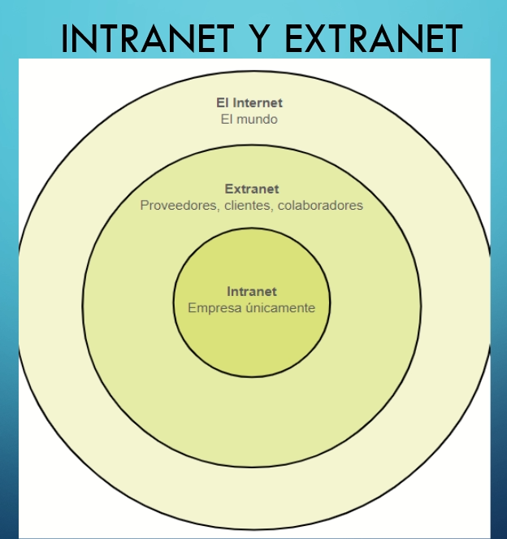
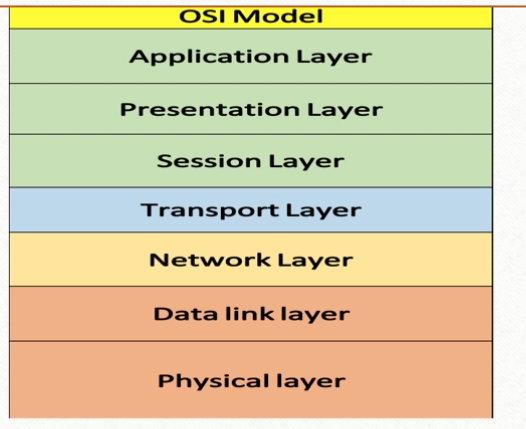
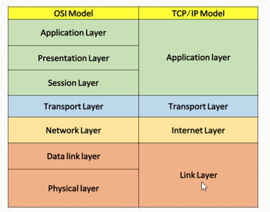

# MÓDULO 1: INTRODUCCIÓN A LAS REDES

## Semana 1

### Red de datos

Para definiarla tenemos los siguientes conceptos

* Dispositivos finales:
  * PC, Laptop, impresoras, celulares, etc
* Dispositivos intermediarios
  * Router, switch, firewall, IDS (detector de intrusos)
* Transmisión por señales
  * Cobre, fibra óptica
* Se basa en estándares y protocolos
* Tipos
  * LAN y WAN

La red de datos es una conexión entre dispositivos finales e intermediarios que se rigen mediante estándares y/o protocolos que ayudan a corresponder alguna necesidad de un cliente. Se trasmite por medio de señales y a grandes rasgos hay dos tipos: LAN y WAN

| LAN (Local Area Network)                        | WAN (Wide Area Network)                                      |
| ----------------------------------------------- | ------------------------------------------------------------ |
| Estándar 802.3 (ethernet)                       | Protocolos (PPP, point to point), HDLC, Frame relay (antes se usaba en routers) |
| Existe broadcast                                | No existe broadcast                                          |
| Administrado por alguna organización individual | Administrador por un ISP                                     |
|                                                 | Cable serial o fibra óptica                                  |

Diagrama de topología

* Física: Ubicación de routers y switch
* Lógica: Con esta configurada

### Internet

(Red de redes)

Conexión entre redes LAN y/o WAN

Se utiliza para satisfacer la necesidad de un cliente

Un proveedor de servicios se encargda de administrarla

La organizaciones encargadas: IETF, ICANN, IAB

#### Intranet y extranet



Un cliente en internet se puede comunicar con una intranet con una VPN (Virtual Private Network , túnel)

### Arquitectura de una red

* Tolerancia a fallas: La topología debe ser redundante
* Calidad de servicio (QoS): Prioridad a los procesos
* Escalabilidad: Topología robusta (soporta cambios a futuro)
* Seguridad: 
  * Disponibilidad
  * Integridad: Capacidad de aceptar o rechazar un mensaje
  * Confidencialidad: SOlo debe ser entendido por el destinatario
    * Cifrado simétrico (fácil de romper)
    * Cifrado asimétrico (llaves públicas y privadas)
  * Autentificación: Demostrar quien dice ser (por lo general se sabe, lo que se tiene, por lo que es)
  * Autorización: Lo que tiene permitido hacer

**(Clase 2)**

Básicamente para la configuración de **routers** y **switches** tenemos que acceder a su sistemas operativo, el cual para el caso de equipos CISCO es **IOS**. Este sistema tiene 3 modos de operación:

* Modo usuario
  * Es en el que el sistema operativo inicia.
  * El *prompt* es muy simple `router>`
* Modo privilegiado 
  * Para entrar escribimos `enable` (La abreviación es `ena`)
  * Cuando estemos dentro se mostrará `router #` en el *prompt*.
* Modo configuración global
  * Para entrar debemos estar en *modo privilegiado*, escribimos `configure terminal` (La abreviación es `config t`)
  * Cuando estemos dentro se mostrará `router(config) #` en el *prompt*.

El modo "sudo" es el *configuración global*.

**Administración de un equipo CISCO**

* Vía cable consola
  * Vía programas 
    * Putty
    * Teratermin
    * Hyperterminal
    * Minicom (Linux)
* Vía remota
* Cable Auxiliar 

**Iniciando ...**

> TODO: Agregar imágenes
>

Una vez conectada nuestra computadora al switch  damos doble click a la computadora y después en *desktop* y por último terminal y damos "ok".

Para el caso del router nos preguntará si queremos iniciar con la configuración por defecto, le dicemos que no.

El switch no nos preguntará nada.

### Comandos básico y útiles

La siguiente tabla se irá completando conforme el avance del curso.

| Comando             | Shortcut | Descripción                               | Disponble en modo usuario | Disponible en modo privilegiado | Disponible en modo config. global |
| ------------------- | -------- | ----------------------------------------- | ------------------------- | ------------------------------- | --------------------------------- |
| ?                   |          | Ayuda                                     | Sí                        | Sí                              | Sí                                |
| exit                |          | Salir del modo en el que nos encontremos. | Sí                        | Sí                              | Sí                                |
| show running-config | show run |                                           | No                        | Sí                              | No                                |
| show version        |          |                                           |                           | Sí                              |                                   |

### Mini práctica

1. Cambiar el *hostname*

   * *Modo config. global*

   ```
   hostname RODRIGO
   ```

   > Verifica con `do show running-config`

2. Poner contraseña al modo privilegiado

   * Modo config. global

   Se pone la contraseña en texto plano

   ```
   enable password cisco
   ```

   Salir y volver entrar para verificar

3. Cifrar las contraseñas

   * *Modo config. global*

   Por defecto se cifran con un *tipo 7*

   ```
   service password-encryption
   ```

4. Crear usuario

   * *Modo config. global*

   ```
   username rfrancisco password 123
   ```

   Configuramos para que nos deje autentificarnos con los usuarios que creamos de forma manual

   ```
   line console 0
   login local
   ```

* Para quitar alguna configuración que hallamos puesto se antepone la palabra `no`. Intentemos con el servicio de encriptación

  * *Modo config. global*

  ```
  no service password-encryption
  ```

  Para verificar puede probar creando otro usuario

  Para habilitarlo 

  ```
  service password-encryption
  ```

5. Configuracion contraseñas de *tipo 5 (Hash)*

   * *Modo config. global*

   ```
   username paco secret ccna-gen21
   ```

   Una ayuda

   ```
   username <USERNAME> ?
   ```

6. Configurar una IP

   * *Modo config. global*

   Primero debemos de ver que interfaces tiene nuestro equipo (con `show run`)

   ```
   interface gigabitEthernet 0/0/0
   ```

   Lo anterior nos llevará al *modo configuración de la interfaz* (prompt `router(config)#`)

   ```
   ip address 192.168.1.1 255.255.255.0
   no shutdown
   ```

- Ahora, para un *switch*

  - Asignamos una IP pero a la Vlan

    - *Modo config. global*

    ```
    interface vlan 1
    ```

    Lo anterior nos llevará al *modo configuración de la interfaz* (prompt `Switch(config)#`)

    ```
    ip address 192.168.1.1 255.255.255.0
    no shutdown
    ```

- Guardar y reiniciar

  * Guardar

    * *Modo privilegiado*

    ```
    copy running-config startup-config
    ```

    Otra manera

    ```
    write 
    ```

    La abreviación es `wr`

  * Reiniciar

    ```
    reload
    ```

    

#### Uso de `do`

Usamos `do` cuando queramos ejecutar un comando que se encuentra disponible en un nivel de privilegios menor. Por ejemplo:

En modo *config global* queremos tirar un comando de *modo privilegiado*, debemos anteponer la palabra `do`: 

````
do show running-config
````

### Modelo OSI



Es un modelo de referencia

1. **Capa física**

   * Cable ethernet o serial

2. **Enlace de datos**

   * Prepara el mensaje hacia un medio diferente
   * Convierte los bits a tramas
   * Interacturan
     * *Switches*, MAC, VLANs, ARP, Spanning Tree, ethernet

3. **Capa de red**

   Busca el mejor canino y usa métricas

   * Las tramas las convierte a paquetes
   * Interactuan
     * *Router*, protocolos de enrutamiento, NAT, direccionamiento IP

4. **Capa de transporte**

   Verifica la comunicación de origen a destinatario

   * Paquetes a segmentos
   * Interactuán
     * Protocolos TCP, UDP

5. **Capa de sesión**

   * Interactua el sistema operativo
   * Inicia, mantiene y finaliza los procesos

6. **Capa de presentación**

   * Lenguaje y código
   * Se lleva a cabo el cifrado de datos

7. **Capa de aplicación**

   * Facebook
   * Twitter

Existe otro model llamada TCP/IP (modelo aplicativo)



### Tarea 1

Manden el packet tracer que realizamos en clase, como 

* hostname en router y switch coloquen su nombre. 
* La contraseña de enable, 
* el nombre de usuario y la contraseña del usuario ustedes pueden elegirla, 
  * solo que al mandarlo por correo especifíquenme cuales son esos datos para yo poder verificarlo. 

El correo donde hay que mandarlo 

<!--* jantoniomg1994@gmail.com-->

* Asunto "práctica 1 ccna gpo1"

**Y cuestionario**