## Semana 04

**(Clases  11, 12, 13)**

### Red remota vs red conectada directamente

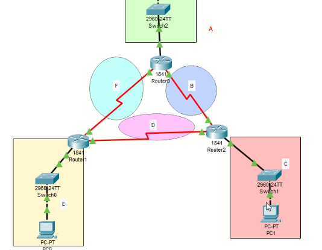

* **Red conectada directamente**: Prácticamente son los cables que le llegan al router
  * Para el caso del router 1: F, D, E
  * Puedo mandar ping y es exitoso.
* **Red remota**: A las que no estamos conectados directamente
  * Para el caso del router 1: A, B, C
  * Falla el ping

**¿Cómo se comunican las redes remotas?**

Por medio del enrutamiento

* Para redes conectadas no directamente
* El router me ayuda a enrutar
* El router busca la mejor ruta

### Enrutamiento

Tenemos dos tipos

* Estático
* Dinámico
  * RIP (Vamos a ver este, ya esta fuera de la currícula)

Son de módulos 2 y 3 del CCNA

#### RIP

* Distancia administrativa (Aplica para enrutamiento eśtatico y dinámico, Grado de confiabilidad que tiene el protocolo de enrutamiento): 120
  * Entre más bajo, mejor
  * En redes conectadas directamente es 0
* Métrica (Método que utiliza el protocolo para llegar el destino): Saltos

```sh
ena
conf t
router rip
# empiezo a anunciar las redes conocidas
# poner todas las redes conectadas directamente al router
network x.x.x.x
version 2
# Version 1 -> Solo IPs de clase
# Version 2 -> Acepta VLSM
```

Para ver la tabla de enrutamiento `show ip route`

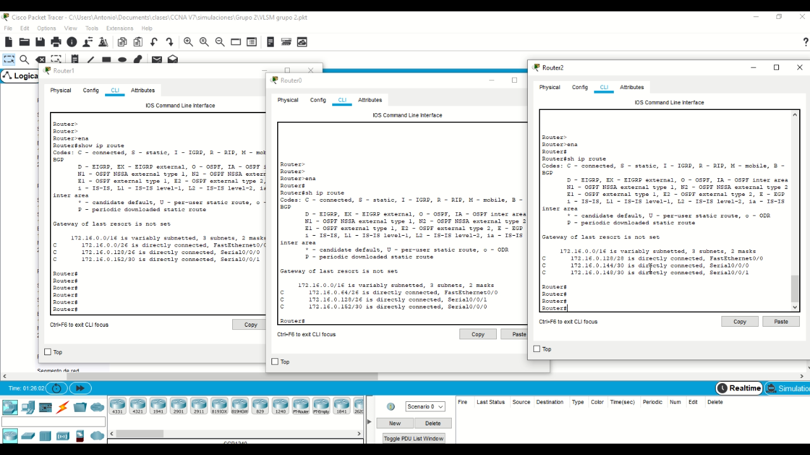

Importante aprender a leer la tabla de enrutamiento

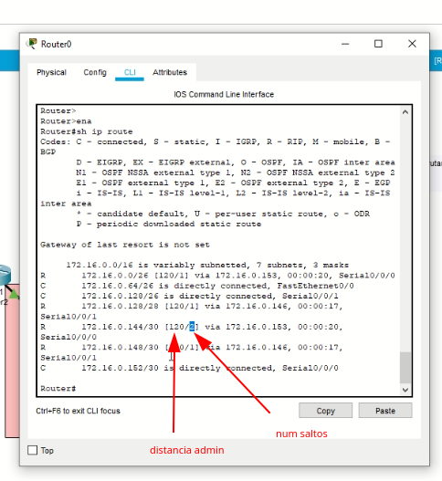

No olvidar tener bien configurado el gateway en cada host 

Todos los router tienen que ser versión 2 si uno es versión 2

**Otro punto interesante:**

Ping de host a host remoto

* En la tabla arp del host se guarda la ip del router (gateway)

  ```
  arp -a
  ```

### TCP, UPD, ..., DHCP

Hablaremos del protocolo TCP y UDP y de los servicios que ofrecen


Direccionamiento con clase, es decir, se ocupa la máscar de la clase.

En este caso estamos usando clase C (máscara 24)

El rango de IP's utiles: 192.168.X.1 - 192.168.X.254

Broadcast: 192.168.X.255

Máscara: 255.255.255.0

#### TPC

* Confiable
* Reconoce datos
* Reenvía los datos perdidos

Protocolos:

* FTP (puerto 20 y 21)
* HTTP (puerto 60)
* SMTP (puerto 25)
* Telnet (puerto 23)
* SSH (puerto 22)
* HTTPS (puerto 443)

#### UDP

* Rápido
* Bajo sobrecargas
* No se requiere reconocimiento
* Entrega los datos a medida que llegan

Protocolos

* TFTP (puerto 69)
* DHCP (puerto 67[cliente] y 68[server])
* DNS (puerto 53)
* SNMP (puerto 161)

#### DHCP

Dynamic Host Control Protocol

Se nos asigna en automático un IP privada

* Su difusión es por mensaje broadcast

**Si en un principio no tengo IP, entonces, ¿Cómo se crea un socket?**

* Sigue el proceso de D. O. R. A
  * D (Discover)
  * O (Offer)
  * R (Request)
  * A (Ack)  

* En primer momento de solicitud por DHCP la IP origen es 0.0.0.0 y busca IP destino 255.255.255.255 para crear el socket

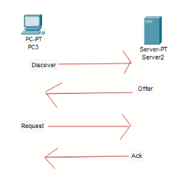

#### Práctica DHCP

1. Arrastrar un servidor de la caja de dispositivos finales.

   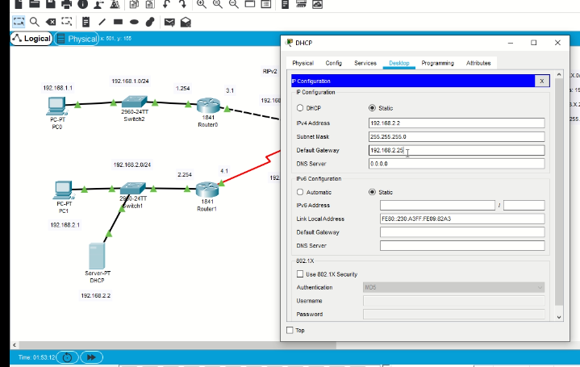

2. Habilitar DHCP en la interfaz gráfica

   

3. Cambiamos la configuración de IP de los host a DHCP

**El router también puede funcionar como router**

```sh
en
conf t
ip dhcp pool RODRIGO
network 192.168.1.0 255.255.255.0
default-router 192.168.1.254
# dns-serer <IP> 
# Todavía no tenemos dns

# Se recomienda excluir las IPs estáticas que ya tengamos asignadas
ip dhcp excluded-address 192.168.1.254
exit
sh r
```

Tu módem funciona como servidor DHCP

Mostras las IPs asignadas.

```
sh ip dhcp binding
sh ip dhcp pool
```

*Probar lo que pasa en modo simulación al elegir ip  config por DHCP*

#### Mini pŕactica HTTP y HTTPS

HTTP (puerto 80)

HTTPS (puerto 443)

1. Colocar un Servidor (va a ser web)

   

2. Abrir la config. de servicios y elegir HTTP

   

   3. Damos click en edit y podemos modificar el html 

   4. Ir a algún host, luego Desktop y finalmente web-browser

      192.168.5.2

      Y Listo!

   #### Mini práctica de DNS

   Le coloca un dominio (alias) a una IP

   1. Arrastrar un servidor, lo colocaremos como DNS
   
      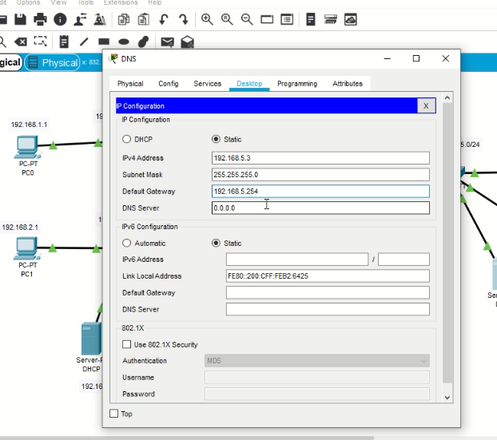
   
   

2. Agregar nuestro sitio web

   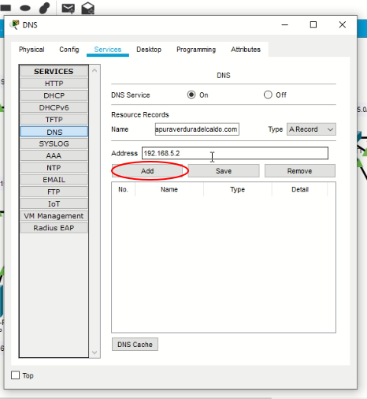

3. Necesitamos configurar la dirección del DNS en el router (DHCP)

   ```
   ena
   conf t
   ip dhcp pool RODRIGO
   dns-server 192.168.5.3
   exit
   ```

4. Modificar el servidor DHCP

   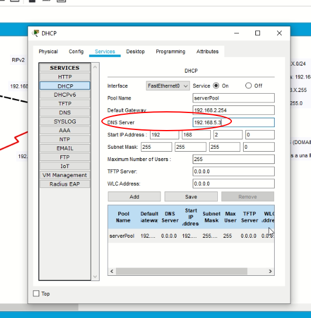

   ​		No olvidar dar click en **save**

   5. Actualizar la configuración de IPs de los hosts (puede ser en estático)
   6. Probar en todos los host
      * Puede que tarde en cargar

#### Mini práctica SMTP

(Simple Main Transfer Protocol)

* MUA (Message User Agent)
* MUA (Message Transfer Agent)

Mensajes de respuesta

* POP: El servidor NO se queda con un respaldo
* IMAP


1. Dar ip al servidor de correo

   

   2. Configurar un nombre de dominio (no olvidar presionar el botón de set) y confgiurar 3 usuarios

      

   3. Configuramos el servicio de email de los host de la siguiente manera

      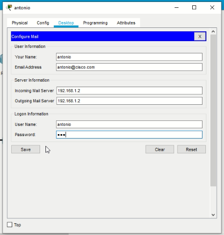

   4. Hacer lo mismo en todos los host

   5. Probamos mandando un email (click en compose)

      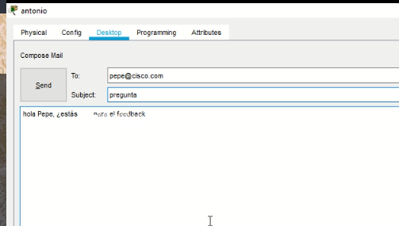

   6. Revisamos si llegó

      

#### Mini práctica FTP

(File transfer Protocol)

* Utiliza dos puertos una para carga y otro para descarga
* Terminología
  * delete=borrar
  * dir=lista
  * get=descargar
  * put=cargar
  * rename=renombrar
  * quit=salir
* Para conectarse
  * ftp <ip>

1. Colocar servidor y configurarlo como se muestra (dejar el usuario por defecto

   

2. Ahora nos conectamos desde algún host por medio del command prompt

   ```
   ftp 192.168.2.4
   ```

   

3. Vamos crear un archivo en el host (Vamos a text Editor). Verificar la existencia del archivo en el command prompt

   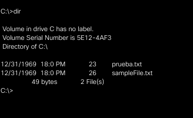

4. El siguiente paso es conectarse nuevamente al servidor ftp y cargar el archivo

   ```
   put prueba.txt
   rename prueba.txt ccna.txt
   dir
   get ccna.txt
   ```

### CDP (Cisco Discovery Protocol)

Sirve para saber que dispositivos tenemos conectados directamente

* Protocolo de capa 2
* Se habilita con `cdp run`
* Se puede ejecutar desde un router o switch

```
show cdp neighbors
```

Se recomienda desactivarlo

```
no cdp run
```

### LLDP

Lo mismo que CDP, solo que funciona para dispositivos que no son cisco

```
lldp run
```

### Default Gateway para Switch

```sh
en
conf t
interface vlan 1
ip address <ip> <mask>
no shutdown

exit
# Desde modo conf global
ip default-gateway 192.168.X.254
```

¿Qué ganamos?

Puedo habilitar un telnet

``` sh
username ccna pass cisco123
line vty 0 15
login local

exit
enable pass 123
```

Cambiar los hostname para apreciar los cambios

```
hostname S0
```

Dede modo privilegiado

```
telnet 192.168.1.253
ena
```

### Tareas

* Para está semana se quedarán 2 entregables. 1 que es terminar su topologia de vlsm con RIP. 
* El otro corresponde a la simulación vista en clase con todos los servidores y gateway en switches como se ven en clase